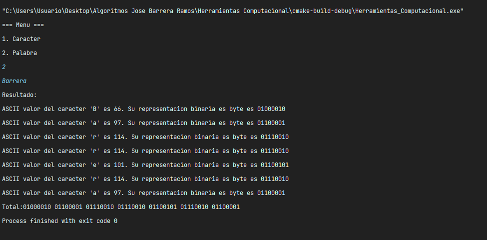
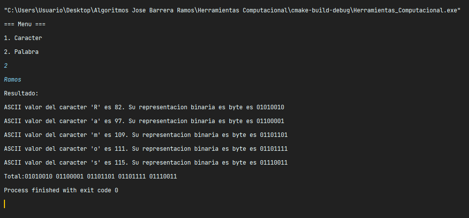
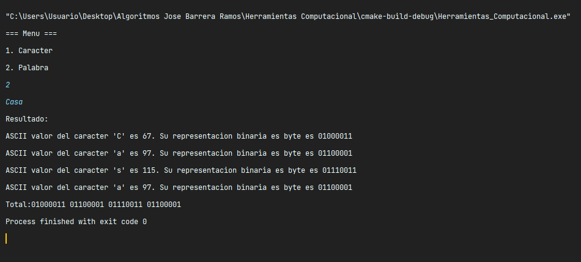

# Examen Final Herramientas Computacionales

Examen Final de Herramientas Computacionales

## Tabla de contenidos

1. [Librerias](#librerias)
2. [Documentacion Funciones](#documentacion-funciones)
3. [Ejemplos](#ejemplos)
4. [Autor](#autor)

## Librerias

```c++
#include <vector>
```

Esta biblioteca pertenece a STL (Standar Template Library) el cual permite implementar un arreglo dinamico, a diferencia
de un arreglo normal, estos arreglos pueden modificar su tamano lo cual permite agregar o eliminar elementos facilmente 
en tiempo de ejecucion

## Documentacion Funciones

### getAscii

Esta funcion convierte un caracter en un valor ASCII

#### Parametros

- 'char caracter': Este es el caracter que se usara para sacar el ASCII

#### Retorno

La funcion debera de retornar un valor entero el cual representa el valor del caracter en ASCII

#### Ejemplo de Uso

```c++
int resultado = getAscii(caracter);
```

### getBytes

Esta funcion convierte un caracter en un valor binario

#### Parametros

- 'char caracter': Este es el caracterque se usara para sacar el valor binario

#### Retorno

La funcion debera de retornar un valor binario

#### Ejemplo de Uso

```c++
string resultado = getBytes(caracter);
```
## Ejemplos







## Paso a paso Github

Para este proyecto use los siguientes comandos:

```
git branch
git checkout -b
git add
git commit -m
git push -u
```

Al momento de hacer commit y push a la rama, desde github hago el pull request manualmente para fusionar las ramas

## Autor

- [@JoseBarreraRamos](https://github.com/JoseBarrera04)

